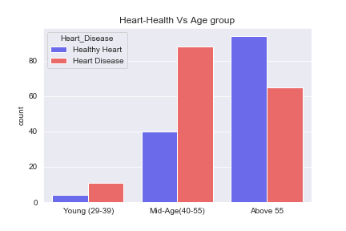

## Heart Disease Detection

## Introduction

It is anticipated that the development of computation methods that can predict the presence of heart disease will significantly reduce heart disease caused mortalities while early detection could lead to substantial reduction in health care costs.

Heart disease is currently the leading cause of death across the globe. Prediction of cardiovascular disease is regarded as one of the most important subjects in the section of clinical data analysis. This makes heart disease a major concern to be dealt with. But it is difficult to identify heart disease because of several contributory risk factors such as diabetes, high blood pressure, high cholesterol, abnormal pulse rate, and many other factors. Due to such constraints, scientists have turned towards modern approaches like Machine Learning for predicting the disease.

This dataset contains some medical information of patients which tells whether that person getting a heart attack chance is less or more. Using the information, we want to explore the dataset and classify the target variable and use different Machine Learning models and find out which model and metric is best suitable for this dataset, and lastly if the dataset useful for future heart disease predictions.  

#### Also, in this project, we will go through the dataset to see: 

1. Which age group had most heart disease?
2. Is male more likely to have heart disease than female?
3. What are the top features?

#### The project consists of 5 phases:

•	Phase 1 Importing the Dataset

•	Phase 2 EDA

•	Phase 3 Feature Engineering

•	Phase 4 Feature Selection

•	Phase 5 Modeling 

#### Libraries Used

•	Panda

•	Numpy

•	Math

•	Matplotlib.pyplot

•	Random

•	Seaborn

•	Math

•	Re

•	Sklearn

•	Statsmodels

## DataSet

The objective of this project is to build a model to predict whether a person diagnose a heart disease based on pattern extracted from analyzing 13 descriptive features plus 1 target column and 1025 observation found in Cleveland, Hungary, Switzerland, and Long Beach V dataset from Kaggle website. The "target" column refers to the presence of heart disease in the patient. It is integer valued 0 = no disease and 1 = disease.

### The remaining 13 features are described in the section below.

1.	age: age 
2.	sex: sex (1 = male; 0 = female)
3.	cp: chest pain type (4 values). Categorical with 4 levels: Type 1: Typical angina. 
Type 2: Atypical angina. Type 3: Non-anginal pain. Type 4: Asymptomatic
4.	trestbps: resting blood pressure 
5.	chol: serum cholesterol in mg/dl 
6.	fbs: fasting blood sugar > 120 mg/dl 
7.	restecg: resting electrocardiographic results (values 0,1,2) 
8.	thalach: maximum heart rate achieved 
9.	exang: exercise induced angina
10.	oldpeak: ST depression induced by exercise relative to rest 
11.	slope: the slope of the peak exercise ST segment 
12.	ca: Number of major vessels (0–4) colored by fluoroscopy
13.	thal: 0 = normal; 1 = fixed defect; 2 = reversable defect

## Data Cleaning

In our initial data cleaning, we had no major issue with our dataset. Our dataset didn’t have any null or nan values. The only major issue we had was understanding the feature columns and renaming it.

## Analysis

   After formatting our data into a useable state, we used various categorization and statistical analysis methods to find answers to our business questions. We took different machine learning algorithm and tried to find algorithm which predict accurately. We used K-Nearest Neighbor, Logistic Regression, Random Forest Classifier, and Decision Tree Classifier. Also, for our metric classification we chose Recall. The reason we chose Recall was because we don’t want to accidentally discharge a heart disease patient. Also, we wanted to classify the maximum number of patients who end up having a cardiac disease with the positive class. After we ran several models, Decision Tree Classifier was the best fit for our dataset.

#### 1. Which age group had the highest heart disease?

We grouped our age column into three groups. Since the dataset patients age started from 29, the first group (Young) were between 29 to 40, our second group (Mid-Age) were between 40 to 55, and our third group (Above) were 55 and up. After working and graphing the data Interestingly, we saw patients that were Mid-Age had the highest heart disease followed by above 55. This can be an indicator that heart disease starting point can be in Mid-Age and up. People over 40 have to be regularly checked so any heart disease can be prevented. 

#### 2. Is male more likely to have heart disease than female?

Our data shows that males are more likely to get heart disease than females. We have to mention that we had more male patients in our dataset than female, and from these patients 92 at of 206 male patients had heart disease and 72 at of 96 female patients had heart disease. We can see by this observation males are more likely to visit the hospital or clinic with heart disease symptom than female.  

#### 3. What are the top features?

Based on our analyzation Chest Pain, Max Heart Rate, and Thalassemia were our top features in heart disease. 

#### Chest Pain: 

There were 4 categorize of chest pain in our dataset.  
Type 1: Typical angina. Type 2: Atypical angina. Type 3: Non-anginal pain. Type 4: Asymptomatic. We saw most patients who had non-anginal type of chest pain had the highest ratio heart disease followed by atypical angina, and asymptomatic. Patients with typical angina had the lowest heart disease ratio. We also saw that patients who have Chest Pain value in type 2, type 3 or type 4 have more heart disease probability.

#### Max Heart Rate: 

Displays the max heart rate achieved by an individual. In our analyzation should that the increase in cardiovascular risk, associated with the acceleration of heart rate, was comparable to the increase in risk observed with high blood pressure. Another finding that we found was, as you can see in the bar plot below, as age increases the Max Heart Rate decreases. To get the maximum heart rate you have to subtract age from 220. This is the average maximum number of times heart should beat per minute during exercise. 

#### Thalassemia: 

Is a blood disorder passed down through families (inherited) in which the body makes an abnormal form or inadequate amount of hemoglobin. Hemoglobin is the protein in red blood cells that carries oxygen. The disorder results in large numbers of red blood cells being destroyed, which leads to anemia. 

Our finding showed most patients were either classified Reversable Defect Thalassemia or Normal. Reversable Defect Thalassemia had the largest number of patients and the most patients who were in this category most likely had heart diseases in compare to the other categories. Normal group had the largest number of patients who did not have heart disease. The smallest category was Fixed Defect which had the lowest number of patients and heart disease

   
After analyzing the data and getting unusual high scores in our models, which is good to have high scores, but at the same time we want to make sure our model is not biased or doesn’t have duplicated data, so because of that we did further investigation to rule out those assumptions. After we investigated, we found out there were 723 duplications in the dataset.  Unfortunately, because of that we had to eliminate those data to make sure our dataset is clean and unbiased for prediction.     

## Conclusion

Heart Disease is one of the major concerns for society today. It is difficult to manually determine the odds of getting heart disease based on risk factors. However, machine learning techniques are useful to predict the output from existing data. 

Based on analysis we found mid aged males are vulnerable to heart diseases than females. Also, Chest Pain, Max Heart Rate, and Thalassemia were the top features of this data. We recommend that both male and female above 40 do regular checking for heart disease so it can preventable at early stages. Also, we suggest that when a patient is checking in, measure the importance features to identify any heart diseases.    

Due to unusual very high scores in our models we had to investigate and eliminate 723 observations due to high multiple duplications. We would like to investigate further to make sure our model is not biased, and our dataset doesn’t have more duplicates inputs. We suggest building a model that will prevent data duplicates from entering into the dataset. Also, we highly recommend collecting more similar data to make our model accurate and useful for identifying patients with heart disease. 

### Further Analysis:

#### To continue this project, we would suggest:

•	Find similar data sets that have lot more features to work with

•	Re-collecting data as more becomes available

•	Automating collection and analysis methods to always have up to date information

•	Consult with a healthcare expert to gain more knowledge about the dataset and features 
